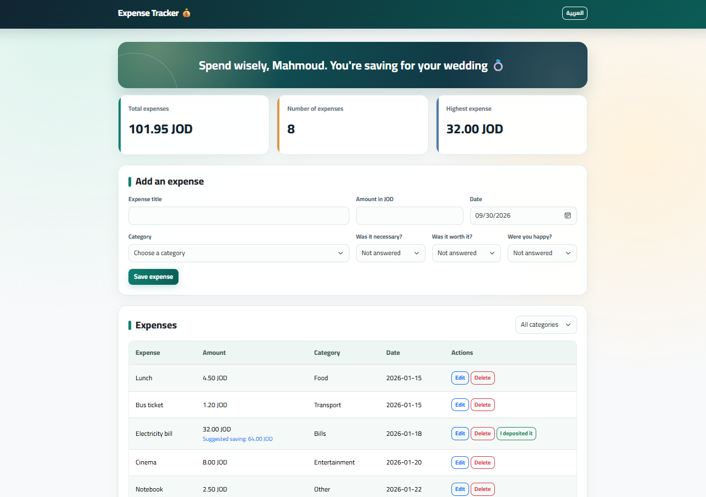
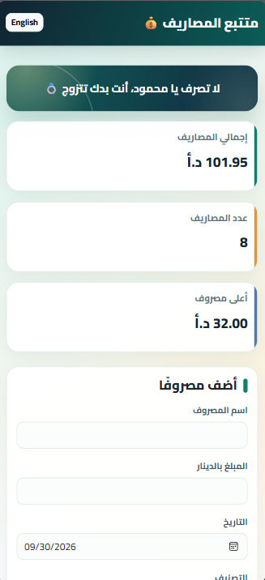

# Expense Tracker

A personal expense tracker built with JavaScript, Express, and PostgreSQL. It helps users record spending, review their expenses, and manage savings for a wedding. The interface supports Arabic and English.

## Requirements

- Node.js and npm
- PostgreSQL
- VS Code with the Live Server extension

## How to Run

1. Create a PostgreSQL database named `expense_tracker`.
2. In pgAdmin, open the Query Tool for that database and run `backend/schema.sql`. It creates the required tables and adds sample expenses if the expenses table is empty.
3. Create a file named `.env` inside `backend` with your own PostgreSQL credentials:

   ```env
   DB_HOST=localhost
   DB_PORT=5432
   DB_USER=postgres
   DB_PASSWORD=*****
   DB_NAME=expense_tracker
   ```

4. Open a terminal in the `backend` folder and run:

   ```powershell
   npm.cmd install
   npm.cmd start
   ```

5. Keep the server running. Open `http://localhost:3000/api/expenses` to check that the API returns JSON.
6. In VS Code, right-click `frontend/index.html` and select **Open with Live Server**.

The `.env` file contains a local password and must not be included in the submitted ZIP.

## Features

- Add, view, edit, and delete expenses with input validation.
- Filter expenses by category and view summary cards.
- Reflect on each expense: whether it was necessary, worth the money, and made the user happy.
- Manage wedding savings with deposits, withdrawals, and the option to undo an entry.
- Suggest saving twice the amount of an expense when it reaches 15 JOD or more.
- Switch between Arabic and English.
- Use the application on desktop and mobile screens.

## Screenshots

### Desktop

### Mobile


## Hardest Part and How I Solved It

The hardest part was connecting the frontend, Express server, and PostgreSQL database. I also encountered a CORS error when the frontend requested data from the server. I checked the browser console and server output, verified that the server was running on port 3000, and corrected the database connection and CORS setup. After that, I tested that expenses could be loaded and saved.

## GitHub Repository

https://github.com/mtgharaibeh23/expense-tracker

## Demo Video

[Watch the demo](https://drive.google.com/file/d/1spmgwkFvM7JFqrIQQdF3VHKSuPDSwVB7/view?usp=drive_link)

